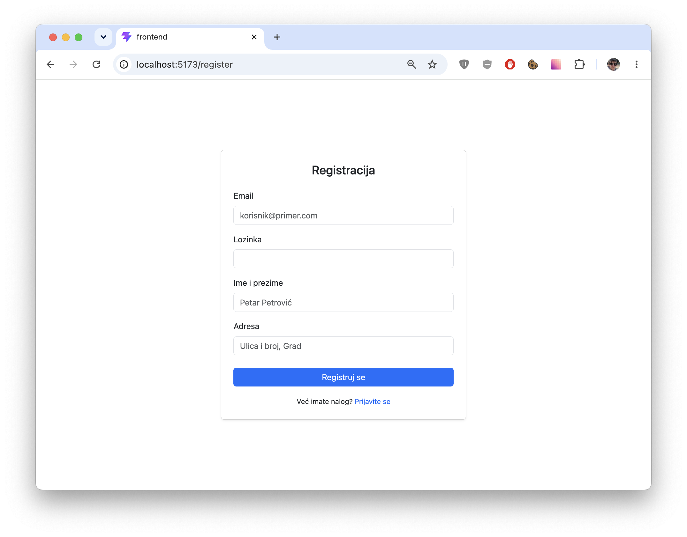
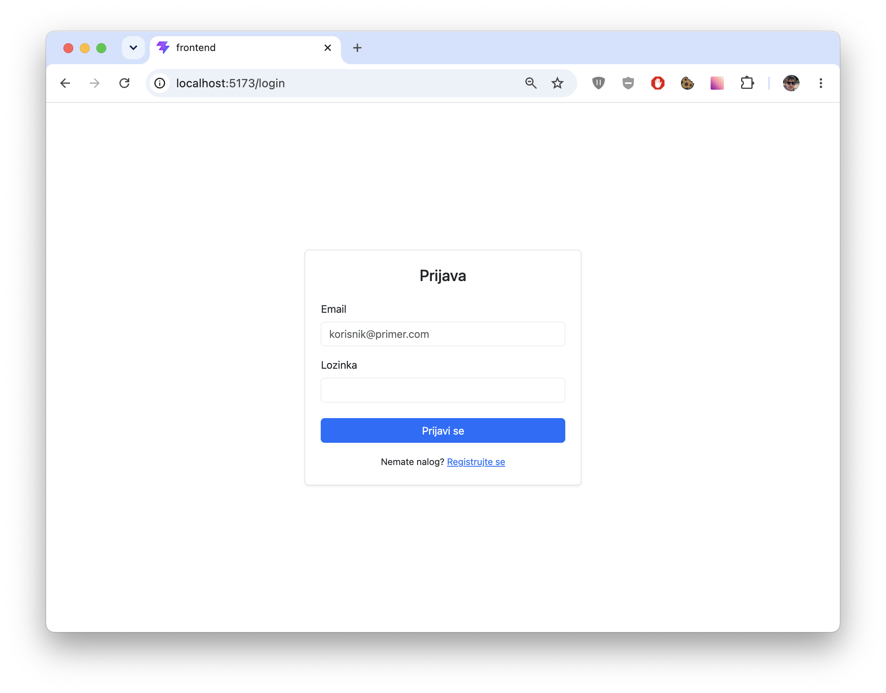
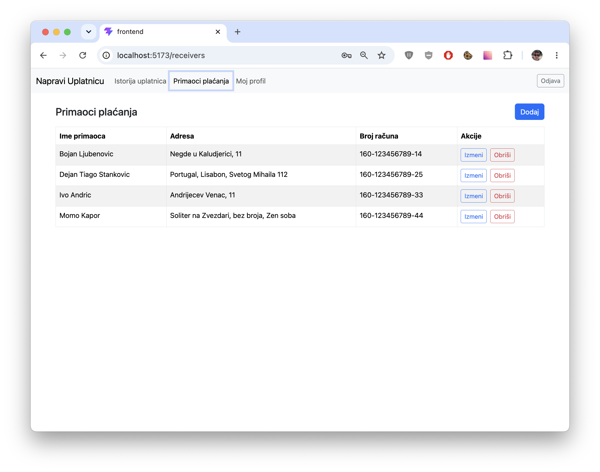
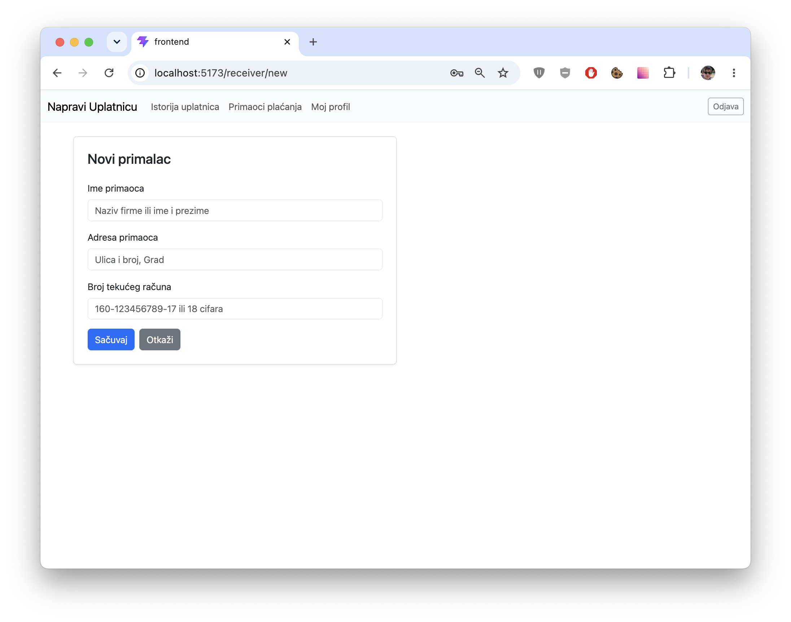
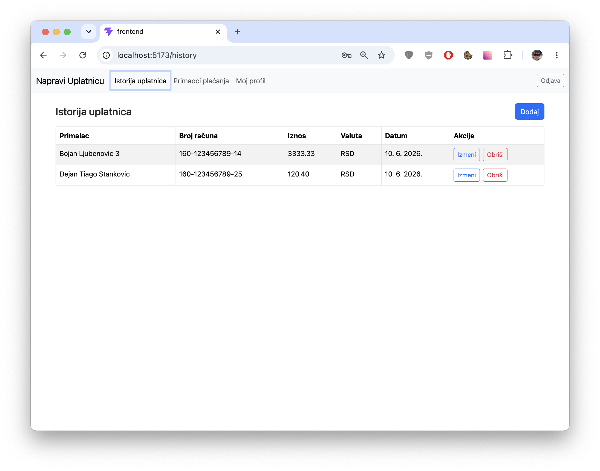
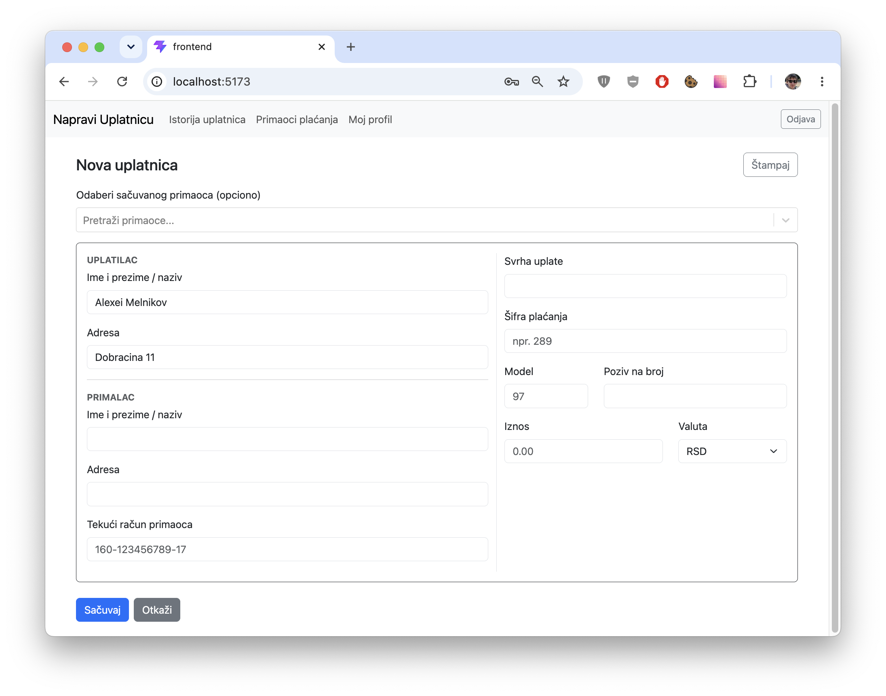
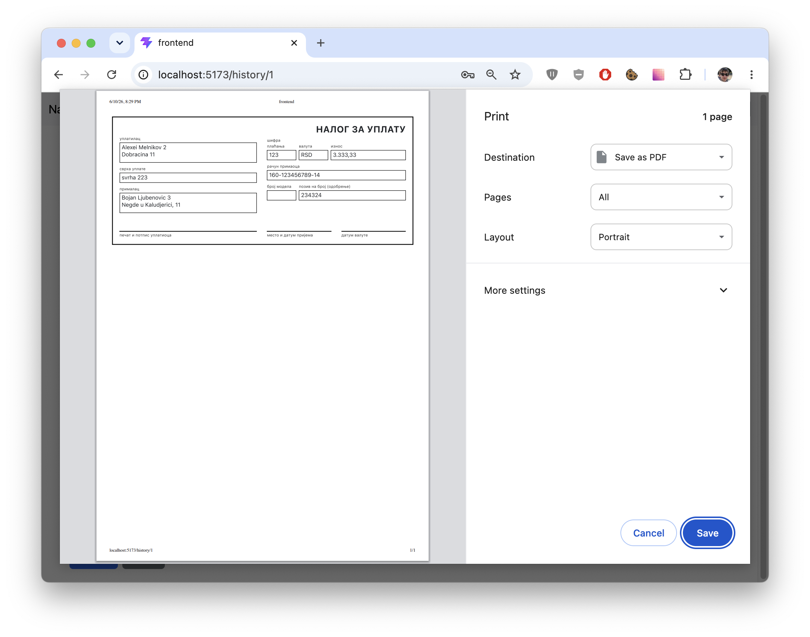
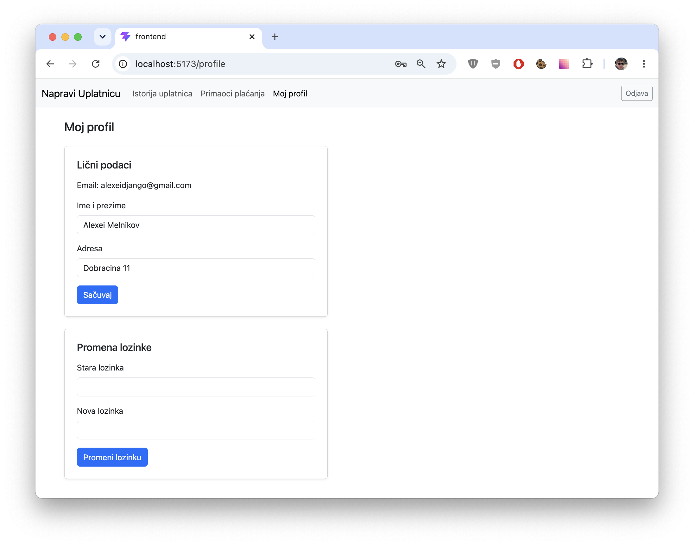

# Projekat za završni deo ispita iz predmeta Razvoj Veb Aplikacija

Projekat je namenjen za demonstraciju uspešno napravljene veb aplikacije, koja omogućava kreiranje i upravljanje uplatnicama (nalozima za uplatu).

## Backend 

Backend je napravljen na tulčejnu Django + DRF + SimpleJWT. S obzirom da je ovo studentski projekat koji nije namenjen za rad u prodakšenu, sqlite se koristi kao baza podataka, Django operiše defoltnim podešavanjima, sve je namenjeno za rad na localhost'u u svrhu demonstracije. 

Validacija podataka je standardna, jedino manje-više zanimljiv je validator računa banke, ali se ne proverava kontrolna suma, samo format (puni i skraćeni, u bazu se sačuva puni format).

Backend deo omogućava REST API za registraciju-autorizaciju, promenu korisničkih podataka i CRUD endpojnte za rad s uplatnicama i primaocima plaćanja.

REST API je napravljen standardnim sredstvima DRFa.

[Detaljnije o API](backend/README.md).

## Frontend

Frontend deo je napravljen uz korišćenje tulčejna TS + React + Axios (potonji nije najbolji izbor, ali vrlo jednostavan); `bootstrap` / `bootstrap-react` je korišćen za UI, dok `react-hook-forms` i `yup` za form handling i frontend/side validaciju. 

Frontend/side validacija je samo udobstvo da se izbegne backend poziv, konačna validacija ionako se vrši na bekendu.

Autorizacioni tokeni se čuvaju u localStorage-u, što definitivno nije najbolja praksa. Takav sam izbor napravio s obzirom da je ovo apsolutno školski projekat koji se nikad neće koristiti u prodakšenu.

S obzirom na to da posle registracije bekend ne vraća token, tokom registracije uneseni korisnički podaci (login i lozinka) se posle uspešne registracije ponovo koriste za login.

Odjava se vrši samo brisanjem tokena.

UI uglavnom ne koristi ikakav custom CSS (uglavnom se koriste bootstrap'ovi stilovi), osim stilova za štampanje uplatnice.

## Snimci ekrana

### Prijava i registracija

### Lista primaoca plaćanja

### Dodavanje primaoca plaćanja

### Lista uplatnica

### Dodavanje uplatnice

### Ekran štampanja uplatnice

### Podešavanja profila

